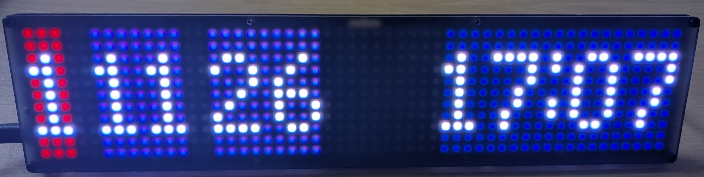

# Pimoroni Galatic Unicorn Train Countdown Clock


This project is a fork of [this excellent MicroPython project](https://github.com/oliciv/pico-departure-board) for displaying national rail train times.

This version of the project displays them on a [Pimoroni Galatic Unicorn](https://shop.pimoroni.com/products/space-unicorns) LED matrix board - displaying the current time and the minutes until the next 3 trains.

This is a much simplified version of the original project and it doesn't have many of the nice features of the original, but I only need something simple for my purposes!

I decided to build this as I found that I was always having to check my phone before leaving the house to see when the next train was (and if it was delayed). This clock removes that process!

The project is a work-in-progress and I'll hopefully be adding a few more features but for now it:
- Displays the number of minutes until the next 3 departures from a particular platform at a station
- Each has a coloured background. Purple (to match the Elizabeth line) for when it's runnign to schedule, orange if the train is delayed, and red for if the train is less than 10 minutes away (time to run to the station!).
- Manually dimmable brightness (will add auto-brightness in future update)
- Updates every minute (this can be configured).

I'll update this readme shortly with further details but here are some relevant details from the readme of the original project (I'll need to minorly edit the deployment details as you'll need the Pimoroni Micropython distrobution). Once again thanks to the creator of the original project, Oli Allen!


## Deploying to the Pico

### 1. Install MicroPython firmware

1. Hold the **BOOTSEL** button on the Pico and plug it into your computer via USB. It will appear as a USB drive called `RPI-RP2`.
2. Download the latest MicroPython `.uf2` firmware for the **Pico W** from [micropython.org/download/RPI_PICO_W](https://micropython.org/download/RPI_PICO_W/).
3. Drag the `.uf2` file onto the `RPI-RP2` drive. The Pico will reboot automatically.

### 2. Upload the code

I use [VS Code](https://code.visualstudio.com/) with the **MicroPico** extension (`paulober.pico-w-go`):

1. Install the extension and open this project folder in VS Code.
2. Connect the Pico via USB.
3. Open the command palette (`Cmd+Shift+P` / `Ctrl+Shift+P`) and run **MicroPico: Upload project to Pico**.

This uploads all project files to the Pico's filesystem. The board will run `main.py` automatically on boot.

Alternatively, you can use [Thonny](https://thonny.org/) or [mpremote](https://docs.micropython.org/en/latest/reference/mpremote.html) to copy files manually.

### 3. Configure

Whichever method you choose, you'll need the following infromation:

- An API token from https://realtime.nationalrail.co.uk/OpenLDBWSRegistration/
- A station code from https://en.wikipedia.org/wiki/UK_railway_stations
- Your WiFi credentials
- Optional: A platform number to filter by


#### Edit JSON files manually

Edit the config files directly on the Pico's filesystem or before uploading the code.

`wifi.json`:

```json
{
    "ssid": "<your-ssid>",
    "password": "<your-password>"
}
```

`api.json`:

```json
{
    "api_token": "<your-api-token>",
    "station_code": "<your-station-code>",
    "platform": "<platform number/letter>",
    "station_name": "<your-station-name>",
    "show_splash_screens": true
}
```


## Constants

There are a few constants that control the behaviour of the departure board that you can tweak in `main.py`:

- **WIFI_MINIMUM_CONNECTION_ATTEMPTS**: The minimum number of WiFi connection attempts to make before proceeding - I used mainly to simulate a slow WiFi connection and test that the status screen was displayed.
- **WIFI_MAXIMUM_CONNECTION_ATTEMPTS**: The maximum number of WiFi connection attempts to make before giving up. If this is reached, the screen will display an error message and wait for a manual reset.
- **DEPARTURE_REFRESH_SECONDS**: The number of seconds to wait between data refreshes.
- **DELAY_PLATFORM_DISPLAY_MS**: The time in milliseconds to display the delay/platform information before switching to a scrolling list of calling points.
- **CALLING_AT_PAUSE_MS**: The delay in milliseconds between the calling points start to scroll.
- **CALLING_AT_SCROLL_MS**: The delay in milliseconds between movements of the calling points list.
- **API_TIMEOUT_SECONDS**: The timeout in seconds for each API request.
- **ROTATE_SCREEN**: Whether to rotate the screen - in case you want to mount it upside down or with the power connector on the other side.
- **TIME_SYNC_HOUR_UTC**: The hour in UTC when we sync the time with an NTP server and check if we have started/finished BST.

## Author

Created by [Oli Allen](https://oliallen.com). Read more about this project on [my blog](https://www.oliciv.net/pico-departure-board).

- GitHub: [oliciv/pico-departure-board](https://github.com/oliciv/pico-departure-board)

## License

This project is licensed under the terms of the GNU General Public License v3.0. It includes code from the following sources:

- [Waveshare Pico_code](https://github.com/waveshare/Pico_code/blob/main/Python/Pico-OLED-1.3/Pico-OLED-1.3(spi).py) - GPL-3.0
